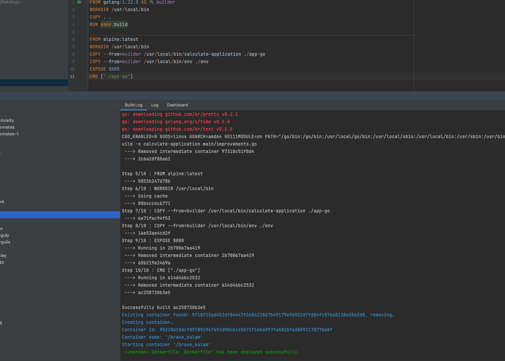

# Problem Statement
Design an application that, given a set of coordinates [(x1,y1),(x2,y2),...],
determines;

- the two closest points between each other
- the two most distant points between each other
- d=√((x_2-x_1)²+(y_2-y_1)²)

Use your knowledge of Golang with clean code to create
an application with automated tests.

Start with tests or implementation, whatever is better for you.

Duration: 45 min

# Tech stack
* Go version : 1.22.0
* Framework : Gorilla mux
* IDE : Intellij IDEA
* Http Client : Resty
* Postman
* Docker Desktop : 4.28.0

# FAQ
* Program written in the interview - INTERVIEW.txt
* Test coverage : run test-coverage in MakeFile

# Images
* Postman Testing
  1. API Request with 1 point
     
  2. API Request with 2 points
     
  3. API Request with 3 points
     
  4. Docker Image built succesfully
     
  5. Docker image running successfully in Docker desktop
     
  6. Executable formed in Docker
     